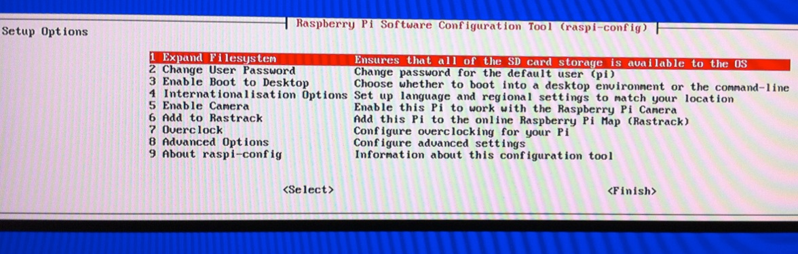

Premier démarrage du Raspberry Pi
=================================

.. _raspbianInstall:

Installation Raspbian
---------------------

Je vais commencé par installer **Raspbian**.
Une distribution Debian (version Wheezy) optimisée pour `Raspberry`.

Télécharger la dernière archive sur raspbian.org_ .

Il faut une carte SD d’au moins 4Go pour installer **Raspbian**.

.. code-block:: guess

   unzip \*-raspbian.zip
   dd bs=1M if=./\*-raspbian.img of=/dev/sdb
   
Ensuite, démarrer le `Raspberry` avec cette carte SD, un écran et un
clavier (le temps de la configuration).

Première configuration
----------------------

À la fin du boot l’utilitaire **raspi-config** devrait se lancer tout seul.

Ce qui donnera cette page :

Dans cet outils je peux configurer le mot de passe pour l’utilisateur `pi`,
modifier le type de clavier (pour passer de qwerty en azerty).

Il faut penser à activer également ssh pour ne plus avoir besoin du clavier
et de l’écran.

Je peux également choisir de démarrer systématiquement sur une console ou
sur un environnement de bureau classique.

Redémarrer. 

Une fois le redémarrage terminé je configure l'adresse ip de ma board en static pour pouvoir me connecter systématiquement à la même adresse.

Pour ça j'ouvre le fichier `/etc/network/interfaces`:

.. code-block:: guess

   #iface eth0 inet dhcp
   iface  eth0 inet static
     address 192.168.1.33
     gateway 192.168.1.1
     netmask 192.168.1.254
  

.. _raspbian.org: http://www.raspberrypi.org/downloads
