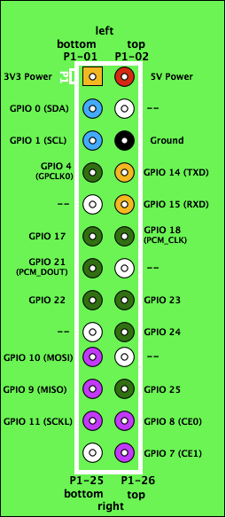
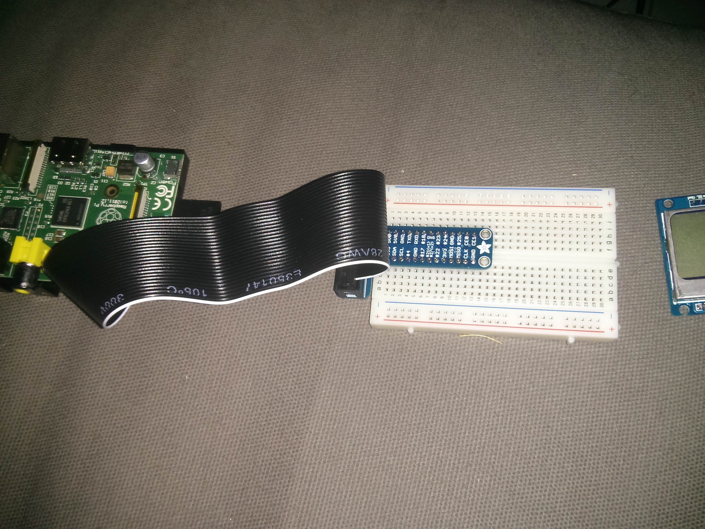

Le GPIO du Raspberry Pi
=======================

Présentation du GPIO
--------------------

Le **GPIO**, General Purpose Input/Output, est un ensemble de broches pouvant
être controllées par une couche logicielle. 

Chaque broche à son utilité, et toutes les broches ne sont pas programmables. Sur le GPIO du Raspberry, 17 sont utilisables sur les 26 broches.

Le schéma de ce bus est:

Utilisation du T-Cobbler
------------------------

Le principal avantage du **T-Cobbler** est que le schema précédent se retrouve
sur la face visible de la partie connectée à la breadboard du coup plus besoin
du schéma on sait directement à quoi correspond chaque broche :

Activer une broche du GPIO
--------------------------
 
Le plus simple pour activer une broche du `Raspberry` rapidement c'est de se connecter en ssh et de lancer ces commandes :

.. code-block:: guess

   $ cd /sys/class/gpio
   $ ls
   export     gpiochip0  unexport
   $ echo 18 > export
   $ ls
   export     gpio18     gpiochip0  unexport
   $ cd gpio18
   $ ls
   active_low  direction   edge        subsystem   uevent      value
   $ echo out > direction
   $ cat value
   0
   $ echo 1 > value

La valeur que je met dans export dépend du numéro de la broche GPIO à
laquelle j'ai connecté le broche LED de l'écran; dans cette exemple 18.

Écrire `out` dans direction pour dire que je veux écrire et non lire.

Je met 1 dans value pour allumer la LED 0 pour l'éteindre. 

Utiliser WringPi
----------------

**WringPi** est un utilitaire disponible pour simplifier l'utilisation du bus.

Il suffit de cloner le repo git git://git.drogon.net/wiringPi. 
Ensuite il faut installer l'utilitaire avec la commande `./build`.

L'utilisation est très simple:

.. code-block:: guess
   
   gpio write 1 0

Dans cette commande on écrit 0 dans gpio identifié par 1. 
Pour savoir quelle broche est représenté par l'identifiant 1 il suffit de se référé au tableau ci dessous:

           +-------------+----------------+
           | GPIO Number | WringPi Number |
           +-------------+----------------+
           | 4           | 7              |
           +-------------+----------------+
           | 17          | 0              |
           +-------------+----------------+
           | R1:21 R2:27 | 2              |
           +-------------+----------------+
           | 22          | 3              |
           +-------------+----------------+
           | 10          | 12             |
           +-------------+----------------+
           | 9           | 13             |
           +-------------+----------------+
           | 11          | 14             |
           +-------------+----------------+
           | 14          | 15             |
           +-------------+----------------+
           | 15          | 16             |
           +-------------+----------------+
           | 18          | 1              |
           +-------------+----------------+
           | 23          | 4              |
           +-------------+----------------+
           | 24          | 5              |
           +-------------+----------------+
           | 25          | 6              |
           +-------------+----------------+
           | 8           | 10             |
           +-------------+----------------+
           | 7           | 11             |
           +-------------+----------------+

Donc dans l'exemple précédent on écrit 0 dans la broche GPIO18.

Pour avoir plus d'info sur l'outils `gpio` il vous suffit de lancer la commande:

.. code-block:: guess

   gpio -h

